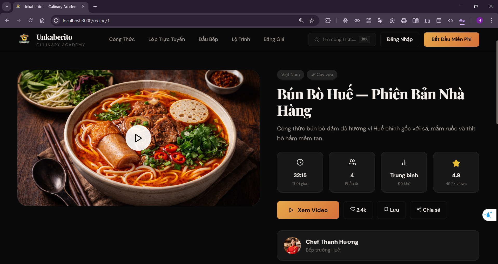
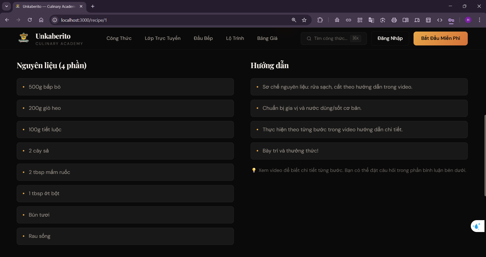
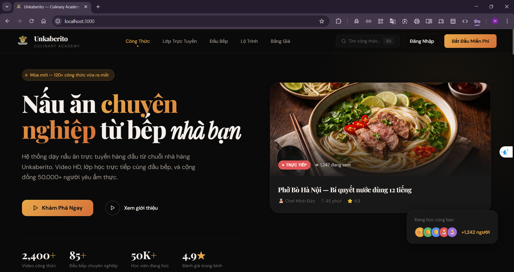
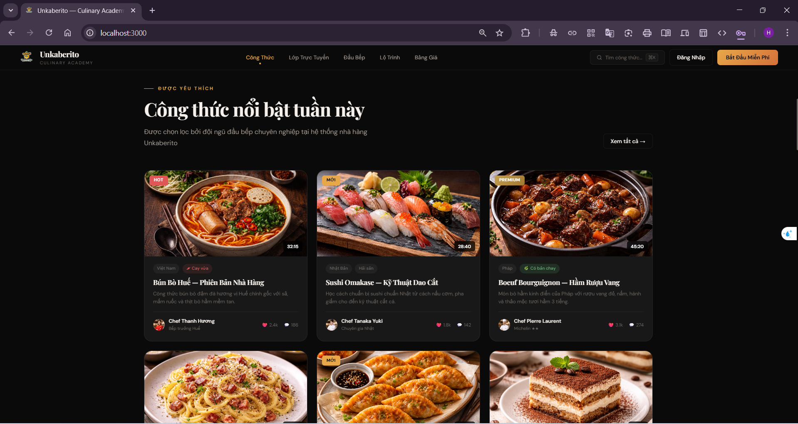
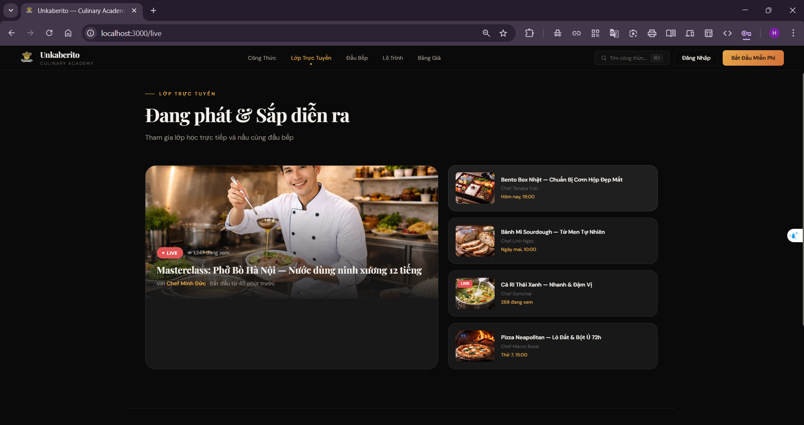
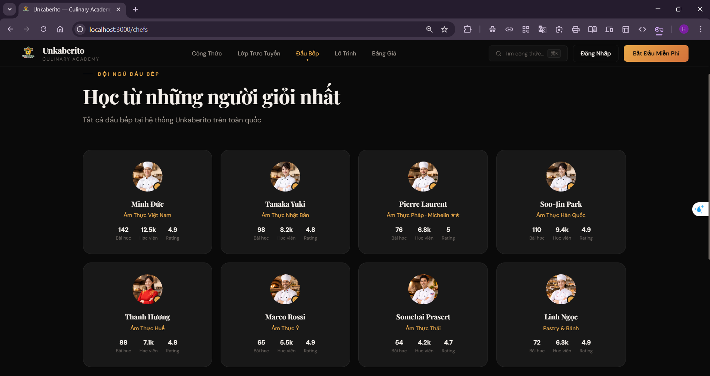
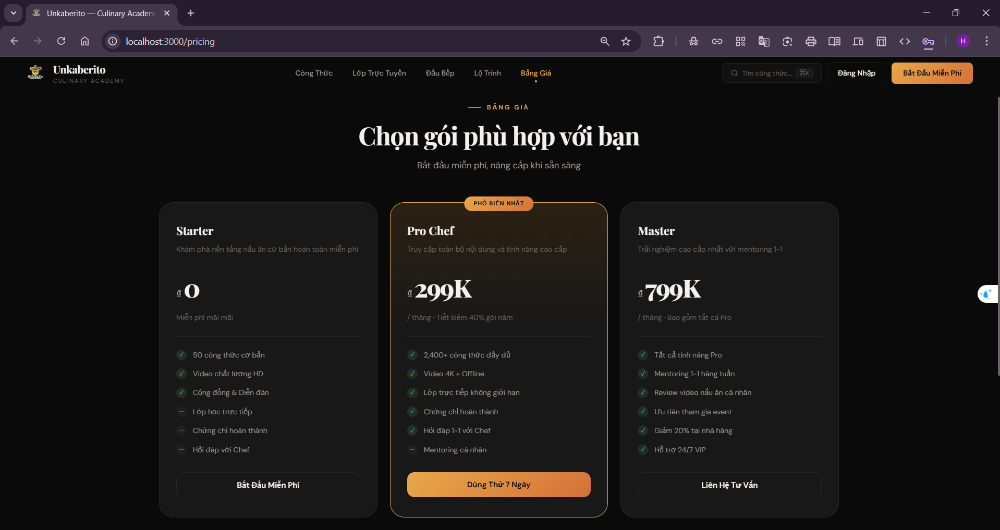
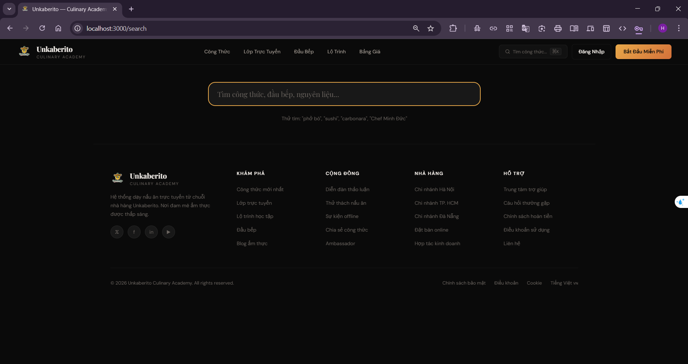
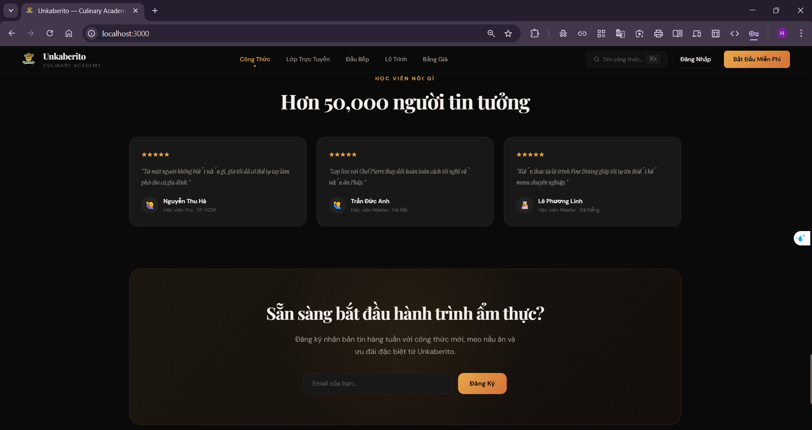
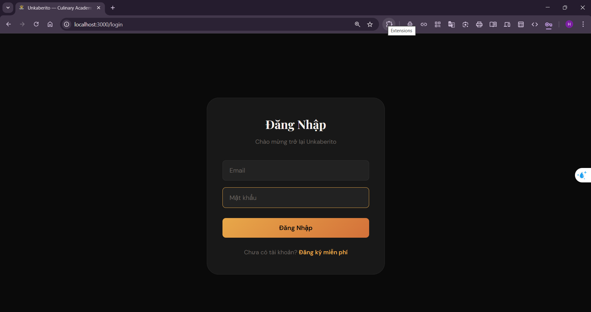

# React-StyledComponents-for-Java-SpringBoot-PostgreSQL













# Unkaberito — Culinary Academy Frontend
## Yêu cầu hệ thống
- Node.js >= 16.x
- npm >= 8.x
## Cấu trúc ban đầu khi mở VSCode

```
unkaberito-frontend/
├── .env.example
├── package.json
├── README.md
├── public/
│   ├── index.html
│   ├── logo.png
│   └── og-cover.jpg
└── src/
    ├── index.js
    ├── App.js
    ├── api/
    │   ├── client.js
    │   └── services.js
    ├── assets/
    │   └── images/
    │       ├── index.js
    │       ├── branding/
    │       │   ├── hero-bg-pattern.png
    │       │   ├── logo.png
    │       │   └── og-cover.jpg
    │       ├── chefs/
    │       │   ├── chef-linh-ngoc.jpg
    │       │   ├── chef-marco.jpg
    │       │   ├── chef-minh-duc.jpg
    │       │   ├── chef-pierre.jpg
    │       │   ├── chef-somchai.jpg
    │       │   ├── chef-soojin.jpg
    │       │   ├── chef-tanaka.jpg
    │       │   └── chef-thanh-huong.jpg
    │       ├── live/
    │       │   ├── live-bento.jpg
    │       │   ├── live-pho-masterclass.jpg
    │       │   ├── live-pizza.jpg
    │       │   ├── live-sourdough.jpg
    │       │   └── live-thai-curry.jpg
    │       └── recipes/
    │           ├── hero-pho.jpg
    │           ├── recipe-boeuf.jpg
    │           ├── recipe-bun-bo-hue.jpg
    │           ├── recipe-carbonara.jpg
    │           ├── recipe-com-tam.jpg
    │           ├── recipe-mandu.jpg
    │           ├── recipe-pad-thai.jpg
    │           ├── recipe-pho-bo.jpg
    │           ├── recipe-sushi.jpg
    │           └── recipe-tiramisu.jpg
    ├── components/
    │   ├── common/
    │   │   └── StyledComponents.js
    │   ├── home/
    │   │   ├── HeroSection.js
    │   │   └── HomeComponents.js
    │   ├── layout/
    │   │   ├── Footer.js
    │   │   ├── Layout.js
    │   │   └── Navbar.js
    │   └── recipe/
    │       └── RecipeCard.js
    ├── context/
    │   └── AuthContext.js
    ├── data/
    │   └── mockData.js
    ├── hooks/
    │   └── index.js
    ├── pages/
    │   ├── HomePage.js
    │   ├── OtherPages.js
    │   ├── RecipeDetailPage.js
    │   └── RecipesPage.js
    ├── routes/
    │   └── AppRouter.js
    ├── styles/
    │   ├── GlobalStyles.js
    │   └── theme.js
    └── utils/
        └── helpers.js
```

### Tạo file môi trường

```bash
cp .env.example .env
```

Nội dung `.env`:

```
REACT_APP_API_URL=http://localhost:8080/api/v1
REACT_APP_NAME=Unkaberito Culinary Academy
```

> Hiện tại project chạy bằng **mock data** (`src/data/mockData.js`), chưa cần backend thật. Biến `REACT_APP_API_URL` sẽ được dùng khi kết nối backend.

### Cài đặt dependencies

```bash
npm install
```

Sau khi chạy xong, cấu trúc project sẽ **sinh thêm** các file/folder:

```
unkaberito-frontend/
├── .env                      ← MỚI (bạn vừa tạo ở bước 2)
├── node_modules/             ← MỚI (npm install sinh ra, ~200MB, chứa toàn bộ thư viện)
│   ├── react/
│   ├── react-dom/
│   ├── react-router-dom/
│   ├── styled-components/
│   ├── react-icons/
│   ├── axios/
│   ├── react-hot-toast/
│   ├── react-intersection-observer/
│   ├── react-scripts/
│   └── ... (hàng nghìn package phụ thuộc)
├── package-lock.json         ← MỚI (npm install sinh ra, lock version chính xác)
├── .env.example
├── package.json
├── README.md
├── public/
│   ├── index.html
│   ├── logo.png
│   └── og-cover.jpg
└── src/
    └── ... (giữ nguyên như ban đầu)
```

### Chạy development server

```bash
npm start
```

Sau khi chạy, terminal hiển thị:

```
Compiled successfully!

You can now view unkaberito-frontend in the browser.

  Local:            http://localhost:3000
  On Your Network:  http://192.168.x.x:3000
```

Mở trình duyệt tại **http://localhost:3000** để trải nghiệm web.

## Tương thích với Backend Java + Spring Boot + PostgreSQL

Frontend này được thiết kế sẵn để kết nối với backend **Java Spring Boot** theo kiến trúc REST API.

### Base URL

```
http://localhost:8080/api/v1
```

Cấu hình trong `.env` → biến `REACT_APP_API_URL`. Khi deploy production, thay bằng domain thật (ví dụ `https://api.unkaberito.com/api/v1`).

### API Client (`src/api/client.js`)

Sử dụng **Axios** với các tính năng đã cài sẵn:

- Tự động gắn **JWT Bearer token** vào mọi request (đọc từ `localStorage.accessToken`)
- Tự động **refresh token** khi nhận HTTP 401 (gọi `POST /auth/refresh`)
- Nếu refresh thất bại → xóa token, redirect về `/login`
- Timeout: 15 giây

### Danh sách API endpoints mà frontend gọi (`src/api/services.js`)

Frontend đã khai báo sẵn toàn bộ API calls. Backend Spring Boot cần expose đúng các endpoint sau:

**Auth:**

```
POST   /api/v1/auth/login
POST   /api/v1/auth/register
POST   /api/v1/auth/logout
POST   /api/v1/auth/refresh
POST   /api/v1/auth/forgot-password
POST   /api/v1/auth/reset-password
GET    /api/v1/auth/me
PUT    /api/v1/auth/me
PUT    /api/v1/auth/change-password
```

**Recipes:**

```
GET    /api/v1/recipes                    ?page, size, sort, category, difficulty
GET    /api/v1/recipes/featured
GET    /api/v1/recipes/trending
GET    /api/v1/recipes/:id
GET    /api/v1/recipes/search             ?q, category, chef, difficulty
GET    /api/v1/chefs/:chefId/recipes
GET    /api/v1/categories/:id/recipes
POST   /api/v1/recipes/:id/like
DELETE /api/v1/recipes/:id/like
POST   /api/v1/recipes/:id/bookmark
DELETE /api/v1/recipes/:id/bookmark
GET    /api/v1/recipes/:id/comments
POST   /api/v1/recipes/:id/comments
POST   /api/v1/recipes/:id/rate
```

**Categories:**

```
GET    /api/v1/categories
```

**Chefs:**

```
GET    /api/v1/chefs                      ?page, size
GET    /api/v1/chefs/featured
GET    /api/v1/chefs/:id
POST   /api/v1/chefs/:id/follow
DELETE /api/v1/chefs/:id/follow
```

**Videos:**

```
GET    /api/v1/videos/:id/stream
PUT    /api/v1/videos/:id/progress        { currentTime, duration, completed }
GET    /api/v1/videos/:id/progress
```

**Live Classes:**

```
GET    /api/v1/live-classes/upcoming
GET    /api/v1/live-classes/live
GET    /api/v1/live-classes/:id
POST   /api/v1/live-classes/:id/register
DELETE /api/v1/live-classes/:id/register
GET    /api/v1/live-classes/:id/token
```

**Learning Paths:**

```
GET    /api/v1/learning-paths
GET    /api/v1/learning-paths/:id
POST   /api/v1/learning-paths/:id/enroll
GET    /api/v1/learning-paths/:id/progress
POST   /api/v1/learning-paths/:id/lessons/:lessonId/complete
```

**Subscriptions:**

```
GET    /api/v1/subscriptions/plans
GET    /api/v1/subscriptions/current
POST   /api/v1/subscriptions              { planId, paymentMethod }
DELETE /api/v1/subscriptions/current
GET    /api/v1/subscriptions/payments
```

**Search & Newsletter:**

```
GET    /api/v1/search                     ?q, type, page
GET    /api/v1/search/suggestions         ?q
POST   /api/v1/newsletter/subscribe       { email }
```

### Spring Boot — Cấu trúc backend tương ứng (gợi ý)

```
com.unkaberito/
├── recipe/
│   ├── RecipeController.java
│   ├── RecipeService.java
│   ├── RecipeRepository.java
│   └── Recipe.java
├── video/
│   ├── VideoController.java
│   ├── VideoService.java
│   └── VideoUploadService.java
├── livestream/
│   ├── LiveClassController.java
│   └── LiveChatWebSocketHandler.java
├── user/
│   ├── AuthController.java
│   ├── UserService.java
│   └── JwtTokenProvider.java
├── subscription/
│   ├── PlanController.java
│   ├── PaymentService.java
│   └── SubscriptionService.java
├── learning/
│   ├── PathController.java
│   └── ProgressService.java
└── common/
    ├── config/
    ├── exception/
    ├── security/
    └── dto/
```

### PostgreSQL — Các bảng chính

```
users ──┬── user_subscriptions ── subscription_plans
        ├── enrollments ── courses
        ├── recipe_likes
        ├── comments
        └── watch_history

chefs (extends users) ── recipes ──┬── recipe_videos
                                   ├── recipe_ingredients
                                   ├── recipe_steps
                                   ├── recipe_tags
                                   └── recipe_categories

live_classes ──┬── live_registrations
               ├── live_chat_messages
               └── live_recordings

learning_paths ── path_courses ── course_lessons ── lesson_progress
```

### Phân quyền (Roles)

Frontend hỗ trợ kiểm tra role từ JWT token thông qua `AuthContext.js`:

```
ROLE_USER     → Gói Starter (miễn phí, 50 công thức cơ bản)
ROLE_PRO      → Gói Pro Chef (2,400+ công thức, live class, chứng chỉ)
ROLE_MASTER   → Gói Master (mentoring 1-1, review cá nhân, VIP)
ROLE_CHEF     → Đầu bếp (tạo/quản lý công thức, dạy live class)
ROLE_ADMIN    → Quản trị hệ thống
```

### Thanh toán

Frontend gọi `POST /api/v1/subscriptions` với `paymentMethod` là một trong:

```
vnpay   → VNPay
momo    → MoMo
zalopay → ZaloPay
```

Backend cần tích hợp cổng thanh toán tương ứng và xử lý webhook callback.

### CORS — Cấu hình Spring Boot

Backend cần cho phép frontend truy cập:

```java
@Configuration
public class CorsConfig implements WebMvcConfigurer {
    @Override
    public void addCorsMappings(CorsRegistry registry) {
        registry.addMapping("/api/**")
            .allowedOrigins("http://localhost:3000")
            .allowedMethods("GET", "POST", "PUT", "DELETE")
            .allowedHeaders("*")
            .allowCredentials(true);
    }
}
```

---

## Chế độ Mock Data

Hiện tại toàn bộ dữ liệu hiển thị trên web lấy từ `src/data/mockData.js` — không cần backend cũng chạy được đầy đủ giao diện. Khi backend sẵn sàng, thay thế mock data bằng API calls thật trong các page components.

---

## Dependencies

```
react                          18.2.0    Core library
react-dom                      18.2.0    DOM rendering
react-router-dom               6.20.0    Client-side routing (12 routes)
styled-components              6.1.0     CSS-in-JS styling
react-icons                    4.12.0    Icon library (Feather Icons)
axios                          1.6.0     HTTP client cho API calls
react-hot-toast                2.4.1     Toast notifications
react-intersection-observer    9.5.0     Scroll animations
react-scripts                  5.0.1     Create React App build toolchain
```

